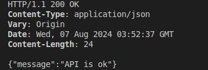
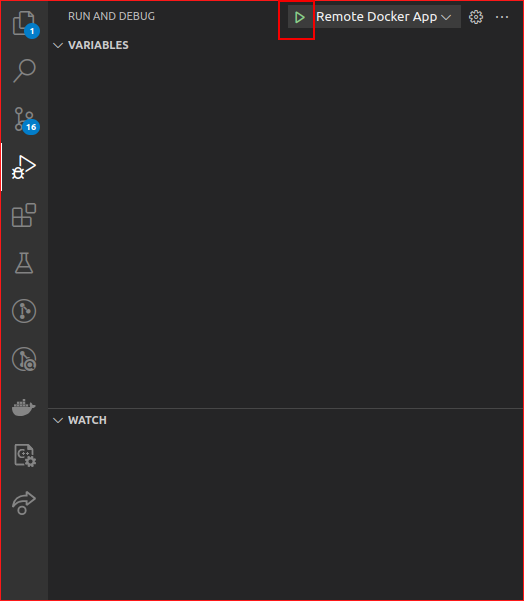
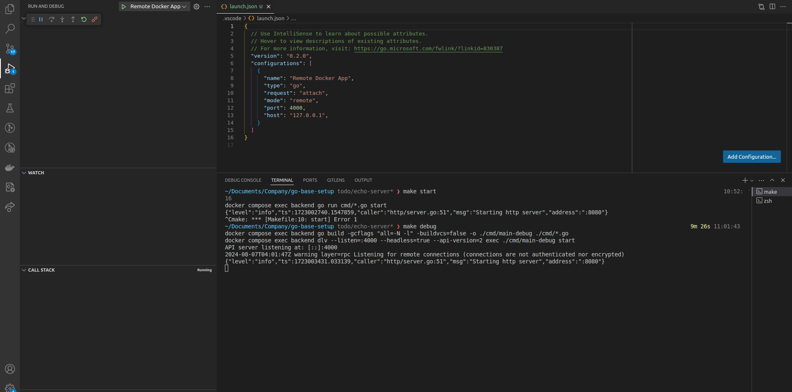

## Các library sử dụng
- http routing: [echo](https://echo.labstack.com/docs)
- validation: [validator](https://github.com/go-playground/validator)
- dependency injection: [wire](https://pkg.go.dev/github.com/google/wire)
- Eloquent: [gorm](https://pkg.go.dev/github.com/google/wire)
- ...


## Cách run project
```sh
# create .env:
cp .env.example .env

# Run docker:
docker compose up -d

# migrate database:
make migrate-up

# start server
make start
```
Test api
```
curl -i localhost:8080/api/v1/health
```

Kết quả:



## Cách để debug trong project

1. Start debug trong container
```sh
make debug
```
2. Mở file `.vscode/launch.json` trên vscode, vào tab debug


3. kết quả như bên dưới là thành công


## Cấu trúc dự án
    .
    ├── ...
    ├── cmd # đây là nơi để start application
    ├── internal
    │   ├── app # Khởi tạo các server cho dự án
    │   ├── common # Khai báo các hằng số
    │   ├── configs # Configurations             
    │   ├── handlers # handlers, middleware cho các server
    │   └── logic # business logic
    │   └── utils # helper function
    │   └── validation # custom validation
    │   └── wiring # Khởi tạo các dependency sẽ được generate ở đây
    └── ...
**Cần lưu ý**:
Để có thể khởi tạo các dependency bằng wire thì chúng ta cần tạo file wireset.go trong mỗi package để  khao báo khởi tạo cho các dependencies tương ứng 

Tham khảo: https://pkg.go.dev/github.com/google/wire
